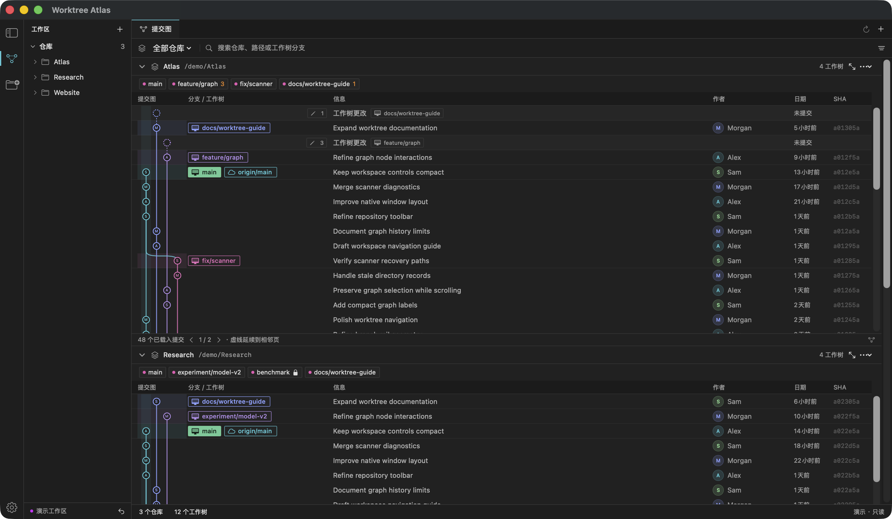
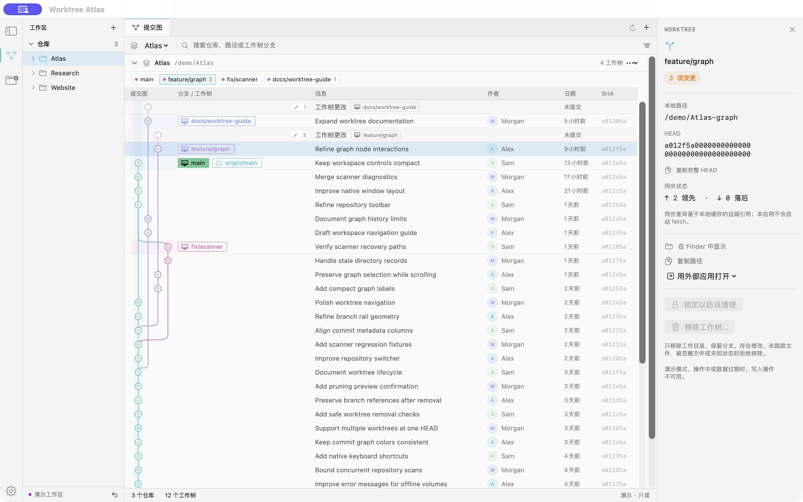

# Worktree Atlas

**See every worktree on the real commit graph.** Worktree Atlas is a native macOS app that brings multiple Git repositories into one window and shows each worktree at its commit, branch, and status.

[简体中文](README.md)



*Native app screenshot · read-only demo data*

## Features

- **Multiple repositories:** Browse them together or focus on one, with search and an attention filter.
- **Real commit graph:** Follow Git branches and merges vertically, with worktrees on their actual HEADs and aligned subjects, authors, dates, and SHAs.
- **Worktree details:** Inspect the branch, path, local changes, lock state, and ahead/behind counts from locally cached refs.
- **Local actions:** Create, lock, unlock, and safely remove worktrees; preview stale-record cleanup first.



*Focused repository and worktree inspector · read-only demo data*

## Run from source

Requires macOS 14+, a Swift 6 toolchain, and Git (2.36+ recommended). This is a development source build. The generated app is at `dist/WorktreeAtlas.app`; it is signed ad hoc and is not notarized.

```bash
git clone https://github.com/SeanYuanWSY/worktree-atlas.git
cd worktree-atlas
./script/build_and_run.sh --demo
```

Demo mode uses only synthetic in-memory repositories. To use your own repositories, run `./script/build_and_run.sh`, then use the **+** button to select a local Git repository.

For development checks, run `./script/check.sh`.

## Safety

The app focuses on local worktrees. It does not commit, push, pull, fetch, merge, rebase, or delete branches. Removing a worktree keeps its branch; main, locked, unknown, modified, untracked, or ignored-file worktrees are not force-removed.

## Attribution and license

Worktree Atlas adapts selected MIT-licensed [GitScope](https://github.com/Oreo992/GitScope) components with upstream credit preserved. Its commit-graph presentation takes visual inspiration from [GitLens](https://github.com/gitkraken/vscode-gitlens); it is not affiliated with GitScope, GitLens, or GitKraken. See [third-party notices](THIRD_PARTY_NOTICES.md) and the [MIT license](LICENSE).
