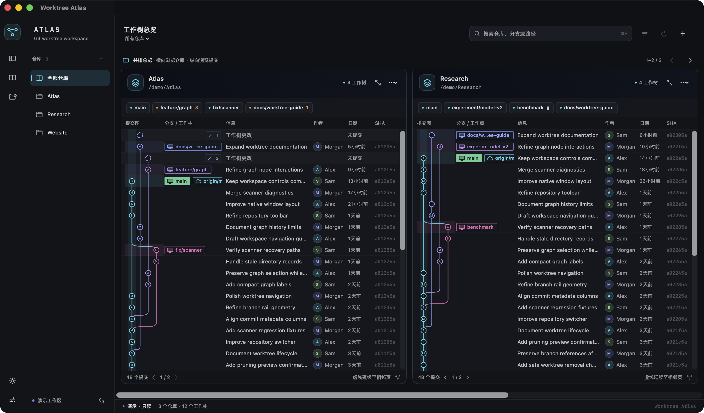
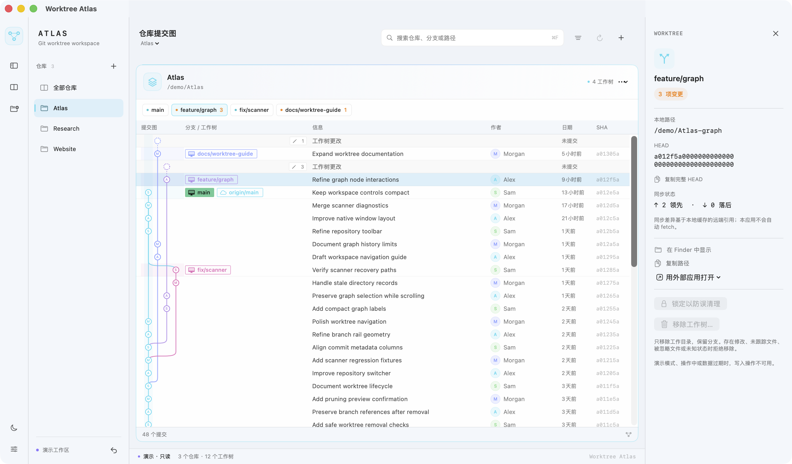

# Worktree Atlas

**在真实提交图上看清每一棵工作树。** Worktree Atlas 是一款原生 macOS 应用，将多个 Git 仓库放在同一个窗口中，直接显示工作树所在的提交、分支和状态。

[English](README.en.md)



*原生应用截图 · 只读演示数据*

## 功能

- **并排多仓库**：横向浏览仓库，纵向浏览各自的提交；也可以聚焦单个仓库，支持搜索与待处理筛选。
- **真实提交图**：纵向展示 Git 分叉与合并，工作树标在各自的 HEAD 上；提交标题、作者、时间和 SHA 按列排列。
- **工作树详情**：查看分支、路径、未提交变更、锁定状态及基于本地引用的领先／落后信息。
- **本地操作**：创建、锁定、解锁和安全移除工作树；清理失效记录前先预览。



*聚焦仓库与工作树详情 · 只读演示数据*

## 从源码运行

需要 macOS 14+、Swift 6 工具链和 Git（建议 2.36+）。目前提供开发版源码构建；生成的应用位于 `dist/WorktreeAtlas.app`，使用本地 ad-hoc 签名，尚未公证。

```bash
git clone https://github.com/SeanYuanWSY/worktree-atlas.git
cd worktree-atlas
./script/build_and_run.sh --demo
```

演示模式只使用内存中的虚构仓库。要管理自己的仓库，运行 `./script/build_and_run.sh`，再点击应用中的 **＋** 选择本地 Git 仓库。

用总览右上角的箭头切换并排仓库，点击仓库的聚焦按钮查看完整列宽；点击工作树查看详情、点击提交标题阅读正文。**⌘F** 搜索，**Esc** 清空搜索或关闭详情。左侧可切换浅深色及显示设置。

开发检查：`./script/check.sh`。

## 安全范围

应用专注于本地工作树，不会执行 commit、push、pull、fetch、merge、rebase 或删除分支。移除工作树会保留分支；主工作树、锁定、状态未知或包含修改及未跟踪／被忽略文件的工作树不会被强制移除。

## 来源与许可

本项目基于 [GitScope](https://github.com/Oreo992/GitScope) 的部分 MIT 许可组件开发，保留原作者署名；界面参考 [GitLens](https://github.com/gitkraken/vscode-gitlens) 的提交图呈现方式，但与 GitScope、GitLens 和 GitKraken 均无官方关联。详见 [来源说明](THIRD_PARTY_NOTICES.md) 和 [MIT 许可证](LICENSE)。
